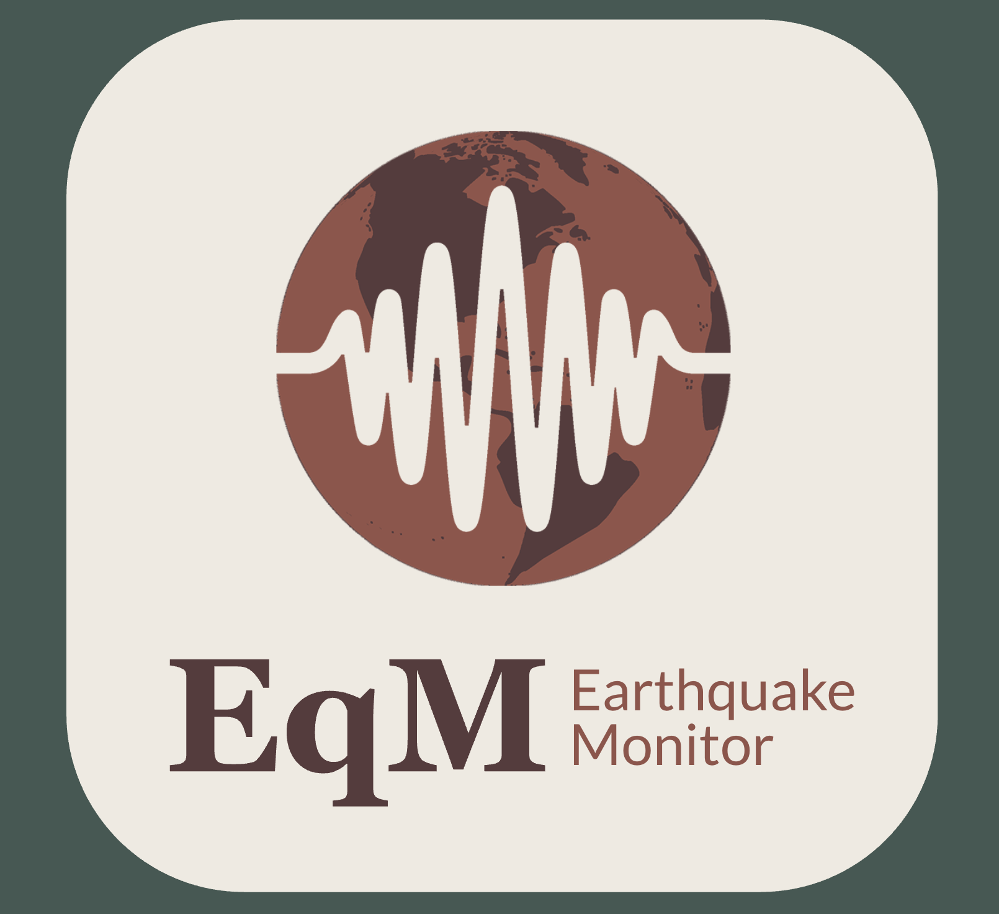

# The Earthquake Monitor
_An earthquake monitoring system using USGS data._

The earthquake monitor collects and stores data on earthquakes in a Postgres database. The data is accessed through the United States Geological Survey’s API and presented it in a way that is intuitive and easy to understand, using a Streamlit dashboard.

Additional features include:
- An AWS-SNS-focused notification system.
- An API for accessing the stored data.
- A daily PDF report generator.

Summary of directories (in the suggested order to visit them):
1. [`planning/`](planning/) - Templates for documentation files and a description of the project's minimum viable product.
1. [`terraform/`](terraform/) - Terraform files for creating a portion of the cloud services the project needs to run.
1. [`architecture/`](architecture/) - A schema for the database, its ERD, and a diagram of the project's architecture.
1. [`notifications/`](notifications/) - Python files for the notification generation portion of the project.
1. [`pipeline/`](pipeline/) - Python files that run the data pipeline, this pulls data from the USGS API and inserts into the database.
1. [`dashboard/`](dashboard/) - Python files for for running the project's dashboard.
1. [`report/`](report/) - Python files for generating daily PDF reports.
1. [`api/`](api/) - Python files to run an API for accessing the data stored in the database.

# Setup (optional)

- `requirements.txt` contains all the required python libraries to run this project.
- As an alternative each directory also contains its own `requirements.txt`.
- If going with option one, run the following commands:
    - Create a venv
        - `python -m venv .venv`
    - Install dependencies
        - `pip install -r requirements.txt`

# Testing

- All the python utilty modules have associated test files in the format `test_<module_name>.py`.

- To run the test suite use the command:
    - `pytest *.py`
    - or
    - `pytest *.py -vvx` for more information.
